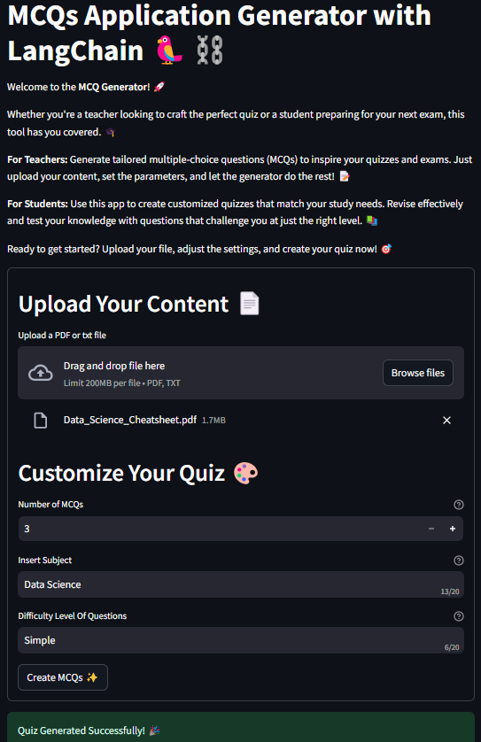
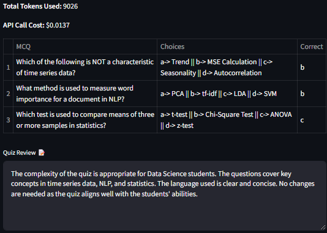
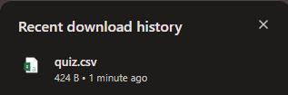

# 📚 MCQ Generator

Welcome to the **MCQ Generator** project! This application allows you to automatically generate multiple-choice questions (MCQs) from any PDF document. Whether you're a student preparing for exams or a teacher setting questions, this tool makes the process efficient and straightforward.

## 🚀 Features

- **PDF Parsing**: Upload a PDF document, and the app will read its content.
- **Automatic Question Generation**: The app generates MCQs based on the content of the PDF.
- **Customizable Options**: Customize the number of questions, subject, and difficulty level.
- **Downloadable Results**: Download the generated MCQs as a CSV file for easy access and review.

## 🛠️ Installation

1. Clone this repository:
   ```bash
   git clone https://github.com/abrahamowodunni/genAI-project

## Install the required dependencies:
```bash
   pip install -r requirements.txt
```


## 🎯 How to Use

1. **Upload Your Content**: Select a PDF or text file containing the material you want to generate questions from.
2. **Customize Your Quiz**: Set the number of MCQs, subject, and difficulty level.
3. **Generate MCQs**: Click the "Create MCQs" button to generate your quiz.
4. **Download the Results**: After generating the quiz, you can download the MCQs as a CSV file.

## 📸 Demo

1. **Main Interface**

   Upload a file and customize your quiz settings.
   

2. **Quiz Generation**

   Generate MCQs with ease and view the results.
   

3. **Download Results**

   Download the generated MCQs as a CSV file.
    
   

## 📄 Files

- `Streamlitapp.py`: Main Streamlit application script.
- `requirements.txt`: List of dependencies required for the project.
- `Response.json`: Configuration file for generating questions.
- `src/`: Contains utility and core scripts for the MCQ generation.

## 🛠️ Troubleshooting

- **Error Generating Questions**: Ensure that the uploaded file is a valid PDF or text document and that the file is correctly formatted.
- **Dependencies Issues**: Make sure all required dependencies are installed. You may need to update or reinstall them.

## 🤝 Contributing

Contributions are welcome! Please fork the repository and submit a pull request with your changes.
